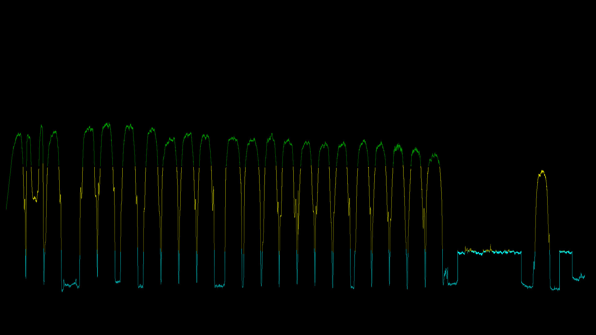

# 	DD_SX8_SDR

ddsx8-spec is an example program written in C to show how to use the SDR mode
of the DigitalDevices MAX SX8 to get IQ data. The program calculates 
the frequency spectrum of the incoming raw IQ data signal around
a given center frequency. The bandwidth used is 51.2 MHz.
The spectrum is written to stdout either in the PAM image format
or as CSV.

**Compilation of the program**

You have to build ddsx8-spec with

`make` 

You need to install the libfftw3 library

On an Ubuntu system this would look like this:

`sudo apt-get install libfftw3-dev`

`cd  DD_SX8_SPECTRUM` 

`make` 

**Usage**

For usage information use the -h option.

Typical calls would be:

`./ddsx8-spec -f 1030000  -k -t >test.csv`

to get the spectrum written to a CSV file, which could be visualized with 
a program like gnuplot (see test.gnuplot).

If you select the PAM format as output you can use ffplay to view the data
as single image:

`/ddsx8-spec -f 1030000  -k  | ffplay -f pam_pipe -`

or continuously:

`./ddsx8-spec -f 1030000  -k -c  | ffplay -f pam_pipe -` 

