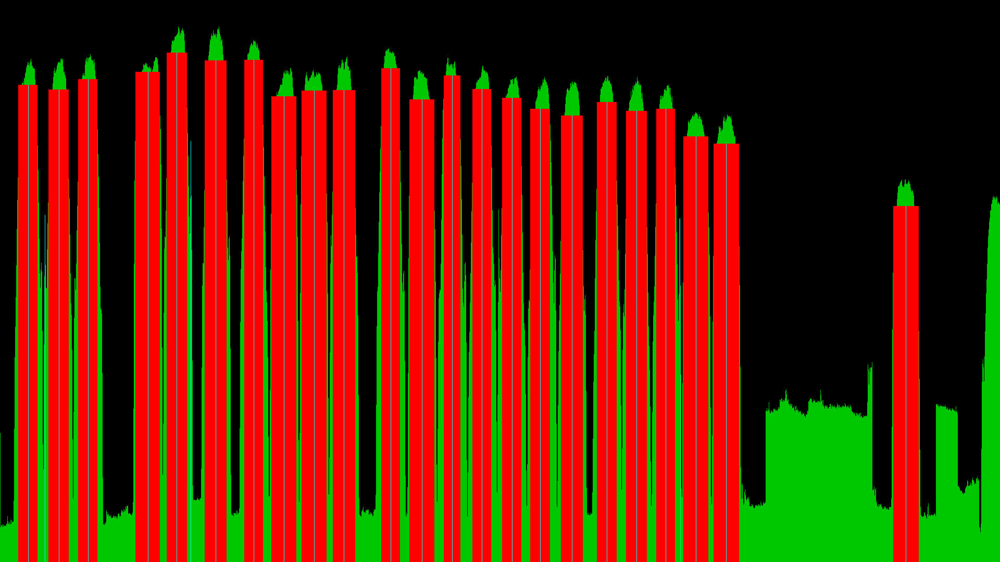

# 	DD_SX8_SDR

The Max SX8 DVB-S/S2/S2X PCIe tuner card by 
[DigitalDevices](https://digitaldevices.de/en/products/dvb-components/max-sx8/)
features an SDR mode that allows one to get the raw IQ data for a given
frequency (in the 950MHz to 2150MHz range) and bandwidth (in the 
following refered to as symbol rate) to a maximum a little above 60MHz.

The program ddsx8-spec is an **example** written in C to show how to use 
the SDR mode of the DigitalDevices MAX SX8 to get the raw IQ data. It
calculates the frequency spectrum of the incoming raw IQ data signal 
around a given center frequency. The bandwidth used is 51.2 MHz ging us 
a 50kHz resolution for an FFT of length 1024.
The spectrum is of course distorted at the edges, due to the finite 
aspect of the FFT. For a full spectrum smaller windows around the center 
of consecutive frequencies are stitched together.

There is a problem with the older SX8 firmwares when trying to do this 
too fast. The SDR feature is still experimental and will and already
has been improved in newer firmwares.

You need to set the polarisation and the band of your LNB via command line.
Unicable tuning is not yet supported and will probably be much slower
for a full spectrum scan, you can still scan the spectrum of the Unicable band
and depending on the settings of the unicable channels should be able to see a
Unicable spectrum like in the picture above.

The spectrum is written to stdout by default either in the PAM image format
or as CSV. Use the -o option to write to a file.

**Compilation of the program**

You have to build ddsx8-spec with

`make` 

You need to install the libfftw3 library which, depending on your System system, would look like this:

Ubuntu: `sudo apt-get install libfftw3-dev`

Debian: `sudo apt-get install libfftw3-dev`

Alpine Linux: `sudo apk add fftw-dev`

then change into the directory of the repository 

`cd  DD_SX8_SPECTRUM` 

and compile the program 

`make` 

**Usage**

For usage information use the -h option.
    
	./ddsx8-spec -h
    usage:

    ddsx8-spec [-f frequency] [-p pol] [-s rate] [-u] [-a adapter] [-i input]
               [-k] [-l alpha] [-b] [-c] [-x (f1 f2)]
               [-d] [-q] [-n number] [-t] [-h] [-o filename]

    -a adapter   : the number n of the DVB adapter, i.e. 
                   /dev/dvb/adapter[n] (default=0)
    -b           : turn on agc
    -c           : continuous PAM output
    -d           : use 1s delay to wait for LNB power up
    -e frontend  : the frontend/dmx/dvr to be used (default=0)
    -f frequency : center frequency of the spectrum in kHz
    -i input     : the physical input of the SX8 (default=0)
    -k           : use Kaiser window before FFT
    -l alpha     : parameter of the Kaiser window
    -n number    : number of FFTs averaging (default 1000)
    -o filename  : output filename (default stdout)
    -p pol       : polarisation 0=vertical 1=horizontal
    -q           : faster FFT
    -s rate      : the symbol rate used for the FFT in Hz
    -t           : output CSV
    -T           : output minimal CSV
    -u           : use hi band of LNB
    -x f1 f2     : full spectrum scan from f1 to f2
                   (default -x 0 : 950000 to 2150000 kHz)
    -h           : this help message
	
    -g s         : blindscan, use s to improve scan (higher
                   s can lead to less false positives,
                   but may lead to missed peaks)
				   
Typical calls would be:

`./ddsx8-spec -f 1030000  -k -t -o test.csv`

to get the spectrum around 1030000 kHz with the (for now) fixed bandwidth of 51200 kHz and write it 
to a CSV file, which could be visualized by using a program like gnuplot (see test.gnuplot).
I switch off the AGC, but with -b you can turn it back on (see dvb.h and dvb.c on how to do it). It should stay off for a full spectrum scan.

If you select the PAM format as output you can use ffplay to view the data
as single image via a pipe:

`./ddsx8-spec -f 1030000  -k  | ffplay -f pam_pipe -`

or continuously:

`./ddsx8-spec -f 1030000  -k -c  | ffplay -f pam_pipe -` 

If you use the -t option and write the resulting comma separated list
into the file test.csv like this: 

`./ddsx8-spec -f 1210000  -t  -o test.csv` 

you can use the gnuplot program to display the data with the added 
gnuplot file test.gnuplot like this:

`gnuplot test.gnuplot` 

The -x option can be used to get a full spectrum scan with CSV output
like this ( it will take a few seconds ):

`./ddsx8-spec  -k -x 0 -t  -o test.csv` 

or as pam

`./ddsx8-spec  -k -x 0  | ffplay -f pam_pipe -` 

or for a specific frequency range, e.g. 1000000 kHz to 1200000 kHz

`./ddsx8-spec -k -x  1000000 1200000  -t  -o test.csv` 

or as pam

`./ddsx8-spec  -k -x 1000000 1200000 | ffplay -f pam_pipe -` 

If you want to stream the video, try using this pipe:

    | ffmpeg -f pam_pipe -i - -vc h264  -f mpegts  - | vlc  -I dummy - --sout='#std{access=http,mux=ts,dst=:8554}'

and play it with

`vlc http://<myip>:8554`

# Blindscan
The -g option of ddsx8-spec is in an experimental stage and will output
a list of peaks on stderr with some information about the peaks.
It will also output a graph that shows the original spectrum and its
modified derivative which is used to determine where the peaks are.
Use the number after g to fine-tune the scan.

`./ddsx8-spec -k -x 0 -g 6 | ffplay -f pam_pipe -`

For my unicable LNB I get the following:
     
	 found 23 peaks
     1. start: 324  stop: 954 freq: 983.30 MHz width: 23.40 MHZ
        height= 51.254053 upslope: 0.008627 downslope: -0.006485 

     2. start: 1044  stop: 1170 freq: 1004.45 MHz width: 0.90 MHZ
        height= 43.429213 upslope: 0.018311 downslope: 0.003429 

     3. start: 1872  stop: 2412 freq: 1055.75 MHz width: 24.30 MHZ
        height= 51.414069 upslope: -nan downslope: -0.007720 

     4. start: 3204  stop: 3960 freq: 1128.20 MHz width: 30.60 MHZ
        height= 51.872362 upslope: 0.018603 downslope: -0.003470 

     5. start: 4572  stop: 4644 freq: 1179.95 MHz width: 0.90 MHZ
        height= 47.932874 upslope: 0.008685 downslope: -0.021443 

     6. start: 4950  stop: 5490 freq: 1209.65 MHz width: 24.30 MHZ
        height= 53.085864 upslope: -nan downslope: -0.006514 

     7. start: 5850  stop: 6408 freq: 1254.65 MHz width: 24.30 MHZ
        height= 52.308362 upslope: -nan downslope: -0.006030 

     8. start: 6480  stop: 7272 freq: 1292.00 MHz width: 30.60 MHZ
        height= 50.609054 upslope: 0.015831 downslope: 0.001396 

     9. start: 8010  stop: 8568 freq: 1363.55 MHz width: 26.10 MHZ
        height= 51.287901 upslope: -nan downslope: -0.006176 

    10. start: 9126  stop: 9684 freq: 1418.90 MHz width: 25.20 MHZ
        height= 51.727733 upslope: -nan downslope: -0.007445 

    11. start: 9810  stop: 10512 freq: 1458.05 MHz width: 29.70 MHZ
        height= 50.603375 upslope: 0.016746 downslope: -0.014481 

    12. start: 10656  stop: 11124 freq: 1493.60 MHz width: 21.60 MHZ
        height= 51.719175 upslope: -nan downslope: -0.008560 

    13. start: 11376  stop: 11862 freq: 1529.60 MHz width: 21.60 MHZ
        height= 51.248797 upslope: -nan downslope: -0.007196 

    14. start: 12096  stop: 12582 freq: 1566.05 MHz width: 22.50 MHZ
        height= 50.733334 upslope: -nan downslope: -0.007800 

    15. start: 12780  stop: 13320 freq: 1600.70 MHz width: 23.40 MHZ
        height= 50.220290 upslope: -nan downslope: -0.006161 

    16. start: 13500  stop: 14040 freq: 1637.60 MHz width: 25.20 MHZ
        height= 49.893844 upslope: -nan downslope: -0.006487 

    17. start: 14382  stop: 14886 freq: 1680.35 MHz width: 22.50 MHZ
        height= 50.597769 upslope: -nan downslope: -0.005337 

    18. start: 15120  stop: 15552 freq: 1715.90 MHz width: 19.80 MHZ
        height= 50.729791 upslope: -nan downslope: -0.004415 

    19. start: 15768  stop: 16308 freq: 1751.45 MHz width: 26.10 MHZ
        height= 49.184995 upslope: -nan downslope: -0.008236 

    20. start: 16326  stop: 16398 freq: 1767.65 MHz width: 0.90 MHZ
        height= 43.515097 upslope: 0.006816 downslope: -0.018857 

    21. start: 16416  stop: 17118 freq: 1787.90 MHz width: 28.80 MHZ
        height= 48.643773 upslope: 0.014783 downslope: -0.011196 

    22. start: 17136  stop: 17838 freq: 1824.35 MHz width: 29.70 MHZ
        height= 48.234743 upslope: 0.013793 downslope: -0.013790 

    23. start: 21456  stop: 22140 freq: 2039.90 MHz width: 30.60 MHZ
        height= 44.742677 upslope: 0.016685 downslope: -0.012275 

# dump_raw

dump_raw is a small program to just dump the IQ data in dump1090 format.
It can be used in conjunction with the [dump1090](https://github.com/MalcolmRobb/dump1090)

Moved to other [repository](https://github.com/drmocm/dump_raw)

#  pam_test

pam_test ist just a helper program to test the pam graphics.
Try

     ./pam_test| ffplay -f pam_pipe -
