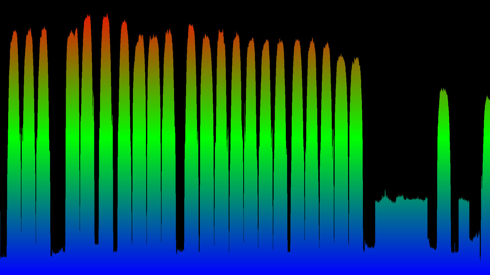

# 	DD_SX8_SDR

ddsx8-spec is an **example** program written in C to show how to use 
the SDR mode of the DigitalDevices MAX SX8 to get IQ data. The program
calculates the frequency spectrum of the incoming raw IQ data signal 
around a given center frequency. The bandwidth used is 51.2 MHz.
The spectrun is of course distorted at the edges, due to the finite 
aspect of the FFT. For a full spectrum smaller windows around the center 
of consecutive frequencies are stitched together.

There is a problem with the older SX8 firmwares when trying to do this 
too fast. The SDR feature is still experimental and will improve in later 
firmwares.

You need to set the polarisation and the band of your LNB via command line.
Unicable tuning is not yet supported and will probably be much slower
for a full spectrum scan. 

The spectrum is written to stdout by default either in the PAM image format
or as CSV. Use the -o option to write to a file.

**Compilation of the program**

You have to build ddsx8-spec with

`make` 

You need to install the libfftw3 library which, depending on your System system, would look like this:

Ubuntu: `sudo apt-get install libfftw3-dev`

Debian: `sudo apt-get install libfftw3-dev`

Alpine Linux: `sudo apk add fftw-dev`

then change into the directory of the repository 

`cd  DD_SX8_SPECTRUM` 

and compile the program 

`make` 

**Usage**

For usage information use the -h option.
    
	./ddsx8-spec -h
    usage:

    ddsx8-spec [-f frequency] [-p pol] [-s rate] [-u] [-a adapter] [-i input]
               [-k] [-l alpha] [-b] [-c] [-x (f1 f2)]
               [-d] [-q] [-n number] [-t] [-h] [-o filename]

    -a adapter   : the number n of the DVB adapter, i.e. 
                   /dev/dvb/adapter[n] (default=0)
    -b           : turn on agc
    -c           : continuous PAM output
    -d           : use 1s delay to wait for LNB power up
    -f frequency : center frequency of the spectrum in kHz
    -i input     : the physical input of the SX8 (default=0)
    -k           : use Kaiser window before FFT
    -l alpha     : parameter of the Kaiser window
    -n number    : number of FFTs averaging (default 1000)
    -o filename  : output filename (default stdout)
    -p pol       : polarisation 0=vertical 1=horizontal
    -q           : faster FFT
    -s rate      : the signal rate used for the FFT in Hz
    -t           : output CSV 
    -u           : use hi band of LNB
    -x f1 f2     : full spectrum scan from f1 to f2
                   (default -x 0 : 950000 to 2150000 kHz)
    -h           : this help message

Typical calls would be:

`./ddsx8-spec -f 1030000  -k -t -o test.csv`

to get the spectrum around 1030000 kHz with the (for now) fixed bandwidth of 51200 kHz and write it 
to a CSV file, which could be visualized by using a program like gnuplot (see test.gnuplot).
I switch off the AGC, but with -b you can turn it back on (see dvb.h and dvb.c on how to do it). It should stay off for a full spectrum scan.

If you select the PAM format as output you can use ffplay to view the data
as single image via a pipe:

`./ddsx8-spec -f 1030000  -k  | ffplay -f pam_pipe -`

or continuously:

`./ddsx8-spec -f 1030000  -k -c  | ffplay -f pam_pipe -` 

If you use the -t option and write the resulting comma separated list
into the file test.csv like this: 

`./ddsx8-spec -f 1210000  -t  -o test.csv` 

you can use the gnuplot program to display the data with the added 
gnuplot file test.gnuplot like this:

`gnuplot test.gnuplot` 

The -x option can be used to get a full spectrum scan with CSV output
like this ( it will take a few seconds ):

`./ddsx8-spec  -k -x 0 -t  -o test.csv` 

or as pam

`./ddsx8-spec  -k -x 0  | ffplay -f pam_pipe -` 

or for a specific frequency range, e.g. 1000000 kHz to 1200000 kHz

`./ddsx8-spec -k -x  1000000 1200000  -t  -o test.csv` 

or as pam

`./ddsx8-spec  -k -x 1000000 1200000 | ffplay -f pam_pipe -` 

If you want to stream the video, try using this pipe:

`| ffmpeg -f pam_pipe -i - -vc h264  -f mpegts  - | SUDO_UID=18290 vlc-wrapper  -I dummy - --sout='#std{access=http,mux=ts,dst=:8554}'`

and play it with

`vlc http://<myip>:8554`
